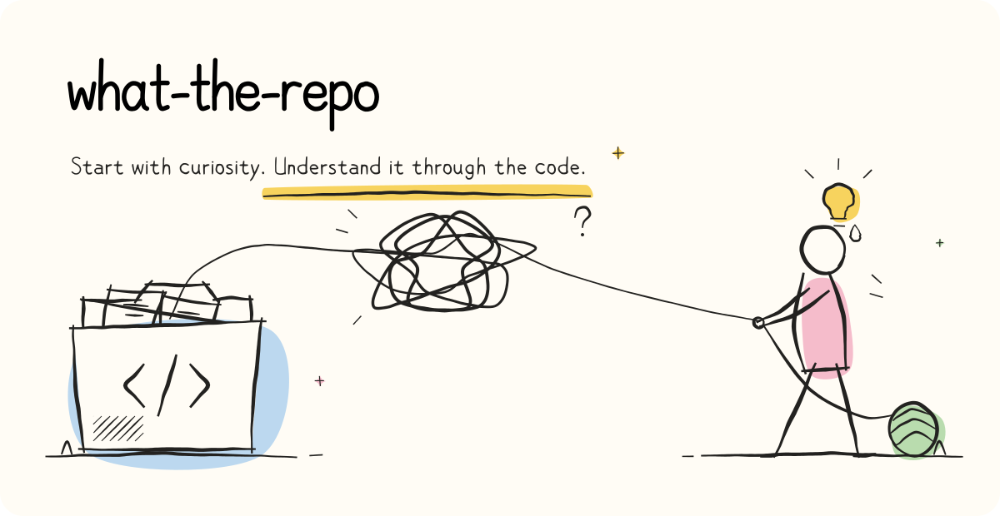
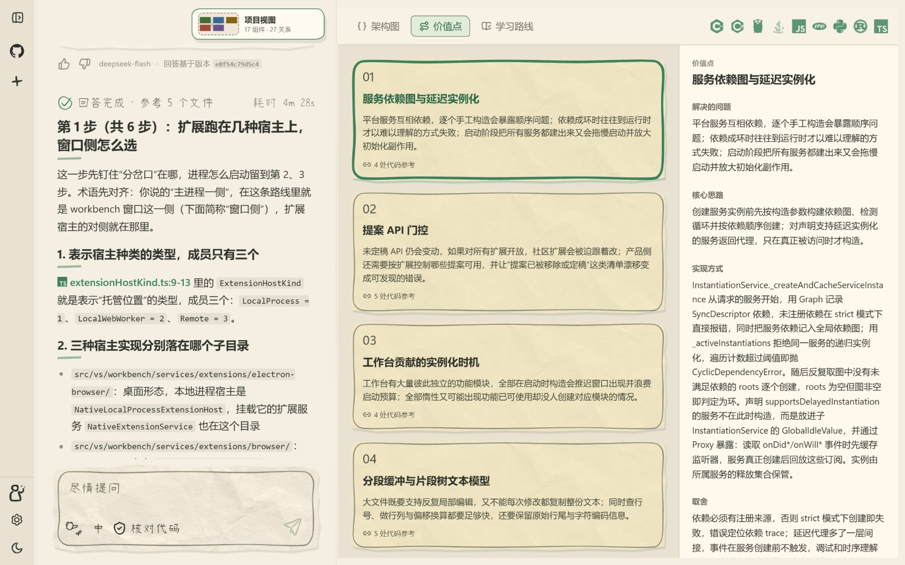
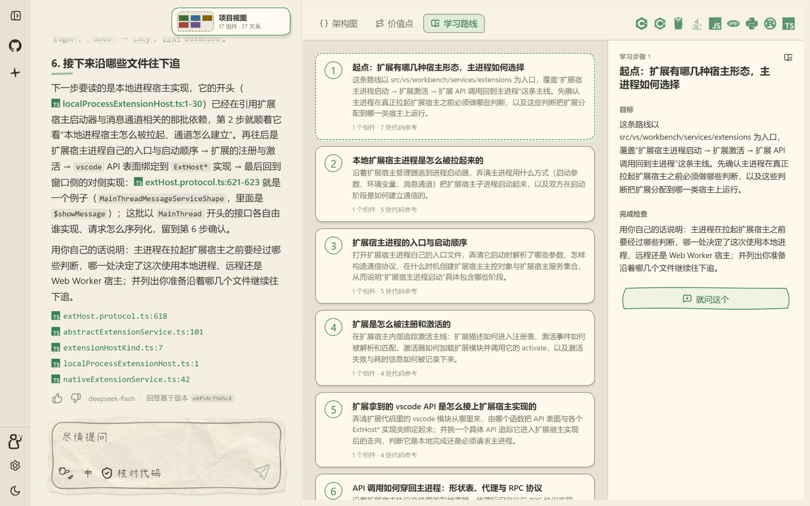
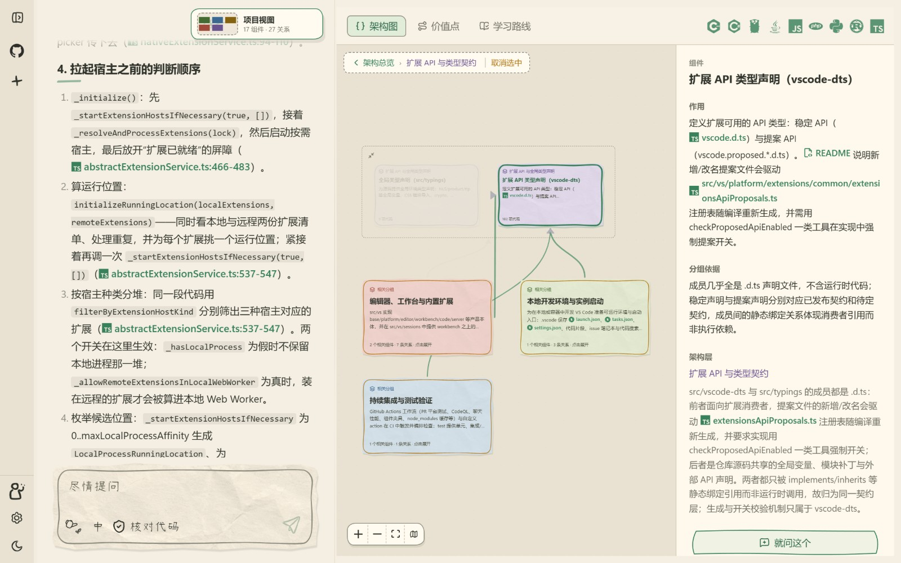

<h1>what-the-repo</h1>

<a href="README.md">简体中文</a> · <strong>English</strong>

<picture><source media="(prefers-color-scheme: dark)" srcset=".github/assets/readme-hero.en.dark.svg"></picture>

  
  
  

## Found an interesting project. Where do you begin?

You know a repository has something to teach you. The hard part is deciding which files to read, which design choices matter, and why they work.

what-the-repo turns that curiosity into focused learning: give it a public GitHub repository, see how it is built, find the designs worth studying, and follow the code until you can explain them yourself.

## What it looks like

These are real pages from studying [microsoft/vscode](https://github.com/microsoft/vscode), with Chinese learning content.

**Find what is worth learning.** Topics in architecture, implementation and engineering tradeoffs, each with the problem it solves and how it is built.

**Set a goal and learn step by step.** A topic becomes a route of small steps, each explained with the code and followed by a few questions to check your understanding. Progress, conversations and a memory summary are kept, so you can pick up where you left off.

**Follow explanations back to the code.** Every conclusion links to the files and lines behind it, and facts are kept apart from inferences. When you need the wider picture, the architecture view connects components and their responsibilities.

## Try asking

> “Which three design choices are most worth studying in this repository? Show me the code behind them.”
>
> “Start at the request entry point and walk me through the main call chain.”
>
> “I want to understand how task recovery works here. Help me plan a learning route.”

## Get started

1. Open **[what-the-repo.com](https://what-the-repo.com)** and sign in with GitHub or continue as a guest.
2. Paste the URL of a public GitHub repository and wait for its analysis.
3. Explore the project view, ask about whatever interests you, or begin guided learning.

The interface and learning content support Chinese and English. The first analysis takes a while, depending on the repository's size and the model's responses.

## Contributing and self-hosting

This repository is the complete source of the hosted product: frontend, backend, repository analysis and agents. To read the code or contribute, see the [contribution guide](CONTRIBUTING.md); to run it on your own server, see [deployment](docs/deployment.md).

Found an incorrect explanation, missing evidence or something awkward to use? [Open an issue](https://github.com/Yecernia/what-the-repo/issues) with the public repository URL and steps to reproduce. Please leave out credentials and private data.

Please follow the [code of conduct](CODE_OF_CONDUCT.md) in community spaces, and see the [security policy](SECURITY.md) to report a vulnerability.

## License and acknowledgements

Original project code is licensed under MIT; third-party code, icons and fonts keep their own terms. The project uses the **Pi SDK** and drew on **CodeBoarding**, **Understand Anything** and other projects during research and implementation. See the [third-party notices](THIRD_PARTY_NOTICES.md).
