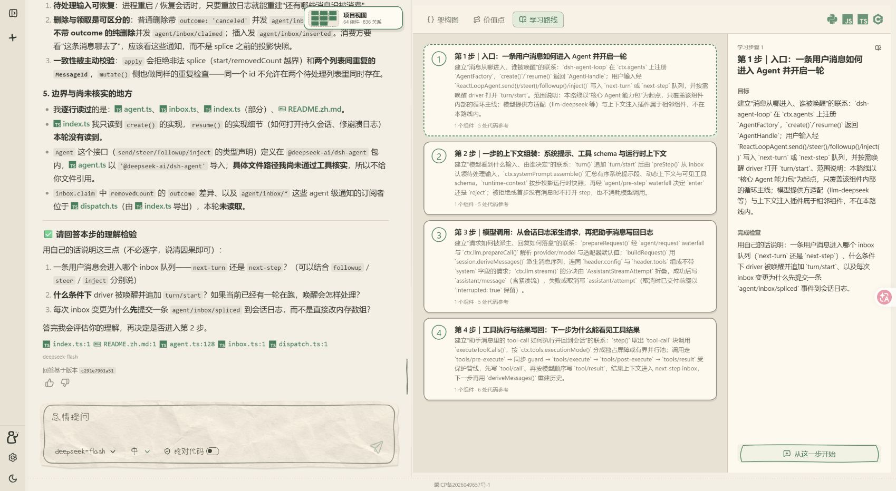
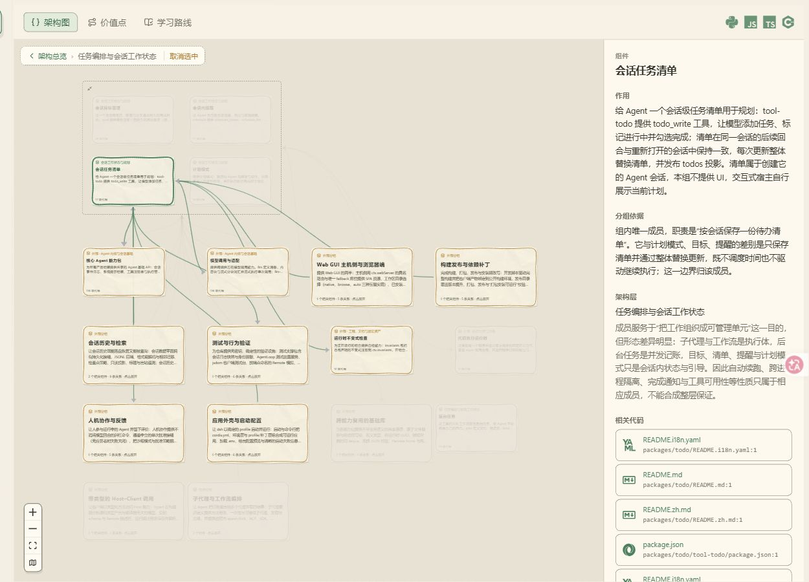

<div align="center">

<h1>what-the-repo</h1>

<p><strong>发现一个开源项目值得学的地方，沿着代码真正弄懂它。</strong></p>
<p>帮助你理解和学习公开 GitHub 仓库。</p>

<p><strong>简体中文</strong> · <a href="README.en.md">English</a></p>

<p>
  <a href="https://bottlecapduel.com"></a>
  <a href="LICENSE"></a>
  <a href="https://github.com/Yecernia/what-the-repo/releases/latest"></a>
  <a href="CONTRIBUTING.zh-CN.md"></a>
</p>

<p></p>

<p><a href="https://bottlecapduel.com"><strong>打开 what-the-repo ↗</strong></a> · <a href="https://github.com/Yecernia/what-the-repo/issues">反馈与建议</a></p>

</div>

## 遇到一个好项目，然后呢？

你可能知道它很厉害，却不知道该先读哪个文件、哪些设计值得学，或者为什么要这样实现。

**what-the-repo 帮你把这份好奇变成有方向的学习。** 提供一个公开 GitHub 仓库，先看清主要结构，再找到感兴趣的设计与实现，结合源码追问、理解，并尝试用自己的话解释。

## 从“想学”到“弄懂”

### 定一个目标，沿着路线一步步学

把感兴趣的主题拆成可以逐步掌握的小目标。确认路线后，结合代码听讲解、追问，再通过理解检验检查自己是否掌握；学习进度也会保留下来。



*实际页面示例：学习 [deepseek-ai/deepseek-harness](https://github.com/deepseek-ai/deepseek-harness) 的 Agent 运行时。*

### 读讲解，也能顺着证据看实现

点击引用文件查看解释背后的代码；需要整体脉络时，再通过架构图探索组件职责和它们之间的关系。



## 可以用它做什么

| 你想弄明白的事 | what-the-repo 可以帮你 |
| --- | --- |
| **有哪些值得我学习的东西？** | 从架构设计、关键实现和工程取舍中发现值得深入的主题，结合仓库内容说明原因。 |
| **这段解释有代码依据吗？** | 顺着文件、符号和行号查看源码，核对解释中的结论，也区分事实、推断和待确认内容。 |
| **我想系统学会这一部分。** | 确认学习目标后生成分步路线，围绕小主题讲解、提问和检查理解；也可以随时自由追问。 |
| **这个项目是怎么组织起来的？** | 浏览架构图、组件及其关系，把入口、职责和主要流程连起来。 |
| **下次还能接着学吗？** | 保存项目、对话和学习状态，通过可查看和调整的记忆摘要，接着之前的内容学。 |

你可以这样问：

> “这个仓库最值得我学习的三个设计是什么？请结合代码说明。”
>
> “从请求入口开始，带我走一遍主要调用链。”
>
> “我想理解这里的任务恢复机制，先帮我制定一条学习路线。”

## 在线开始

1. 打开 **[bottlecapduel.com](https://bottlecapduel.com)**，通过 GitHub 登录或使用访客入口。
2. 输入一个**公开 GitHub 仓库链接**，等待分析完成。
3. 浏览项目视图，选择感兴趣的内容提问，或开始一段引导式学习。

界面和学习内容支持中文、英文。首次分析需要时间，耗时会随仓库规模和模型响应变化。

## 这个仓库包含什么

这里开源的是 **what-the-repo 在线 Web 产品的源码**，包括前端、后端、仓库分析、Agent、测试与通用运行配置。直接体验产品不需要下载本仓库，也不需要安装 Docker。

如果你想阅读实现或参与开发，请看 [贡献指南](CONTRIBUTING.zh-CN.md)。代码入口和常用命令见 [AGENTS.md](AGENTS.md)。目前没有单独发布免登录的本地版或桌面客户端。

## 开发与独立部署

运行的是同一套 Web 产品，不是独立的桌面版或个人版。本机开发入口见 [AGENTS.md](AGENTS.md)。容器运行需要 Docker、Linux 容器和 Docker Compose 2.24.4 或更新版本。

将 `.env.example` 复制为被忽略的 `.secrets/runtime.env`，填写自己的数据库密码、会话与加密密钥、GitHub OAuth 应用及模型配置。容器模式设置 `WHAT_THE_REPO_REDIS_URL=redis://redis:6379`，OAuth 回调使用 `<WHAT_THE_REPO_WEB_URL>/api/auth/github/callback`（本机为 `http://127.0.0.1:5307/api/auth/github/callback`，不是内部 API 端口）。对外部署时设置 `NODE_ENV=production`、自己的 HTTPS `WHAT_THE_REPO_WEB_URL`，并在自己的 OAuth 应用中登记对应回调。COS、MCP、管理台和搜索等可选功能可以不配置。

```sh
docker compose --env-file .secrets/runtime.env -f compose.runtime.yaml up --build -d --wait
```

编排会初始化数据库并启动 PostgreSQL、Redis、API、分析 Worker、清理调度器和前端。Web 默认从 `127.0.0.1:5307` 访问，API 和数据库不直接对外开放。服务器需自行配置 HTTPS 反向代理，可参考[占位符 Nginx 模板](infra/docker/public-edge.nginx.conf.template)。数据保存在命名卷中，需自行安排和验证异机备份。实例专用端口、资源上限和网络设置放在被忽略的 `compose.instance.yaml`，通过额外的 `-f` 加载。

可用 `--scale api=2 --scale analysis-worker=2` 验证同一服务代码的多副本行为，清理调度器保持单实例。`--profile monitoring` 需配置自己的指标 Token 和 Grafana 凭据；`--profile evolution` 需配置独立模型，并会给予受信任 Worker Docker 访问权限，默认不启动。需要文件密钥和只读服务文件系统时，可增加 [compose.runtime-secrets.yaml](compose.runtime-secrets.yaml)，在 `WTR_SECRET_ROOT` 下提供其中声明的文件，并确保容器用户能够读取其挂载文件；此可选配置不会生成凭据。

PR 验证提供[运行配置检查](scripts/test-runtime-config.mjs)、[多副本与故障切换测试](scripts/test-runtime-compose.ps1)和[隔离 PostgreSQL 测试](scripts/test-postgres.mjs)，不依赖维护者的账号或部署文件。

## 反馈与贡献

发现解释有误、证据缺失或操作不顺手，欢迎 [提交 Issue](https://github.com/Yecernia/what-the-repo/issues)。附上公开仓库链接、复现步骤和预期结果，会更容易定位问题；请不要附带密钥或私人数据。

代码和文档改进欢迎通过 PR 提交，具体流程见 [贡献指南](CONTRIBUTING.zh-CN.md)。

参与交流请遵守[社区行为规范](CODE_OF_CONDUCT.zh-CN.md)；报告漏洞请先阅读[安全报告说明](SECURITY.zh-CN.md)。

## 许可与致谢

项目自有代码采用 [MIT 许可证](LICENSE)。第三方代码、图标和字体保留各自的许可条款。

项目使用 **Pi SDK**，并在研究与实现过程中参考了 **CodeBoarding、Understand Anything** 等项目。采用的思路与版权声明见 [第三方声明](THIRD_PARTY_NOTICES.md)。

---

<p align="center">MIT License © 2026 Yecernia</p>
