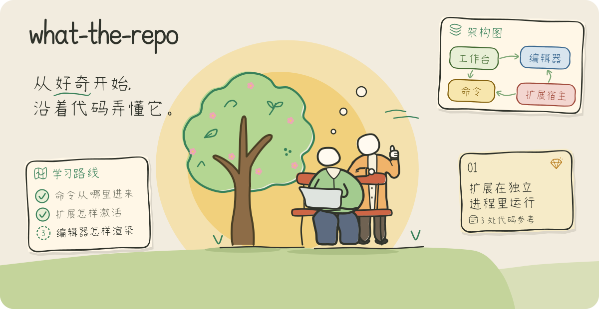
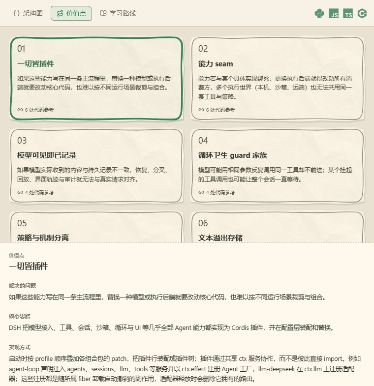
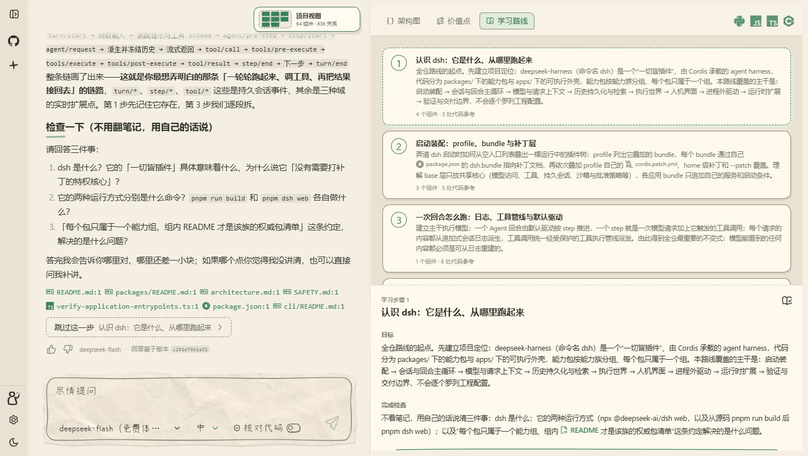
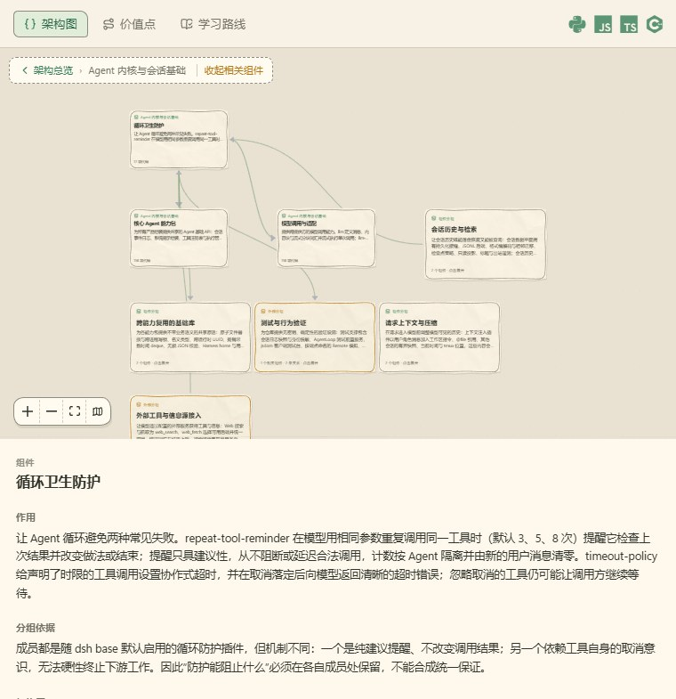

<h1>what-the-repo</h1>

<strong>简体中文</strong> · <a href="README.en.md">English</a>

  
  
  

## 遇到一个好项目，然后呢？

你知道它很厉害，却不知道该先读哪个文件、哪些设计值得学，又为什么要这样实现。

what-the-repo 帮你把这份好奇变成有方向的学习：给它一个公开的 GitHub 仓库，先看清主要结构，再找到值得学的设计，沿着源码追问，直到能用自己的话讲出来。

## 看看它长什么样

下面是学习 [deepseek-ai/deepseek-harness](https://github.com/deepseek-ai/deepseek-harness) 时的实际页面。

**找到值得学的地方。** 从架构设计、关键实现和工程取舍里挑出值得深入的主题，并说明它解决了什么问题、是怎么实现的。

**定一个目标，一步步学。** 把想学的内容拆成分步路线，每一步结合代码讲解，再用几个问题检查自己是否真的懂了。进度、对话和记忆摘要都会保存，下次接着学。

**顺着讲解看代码。** 每个结论都能点开对应的文件和行号核对，也会分清哪些是事实、哪些是推断。需要整体脉络时，架构图会把组件的职责和关系连起来。

## 可以这样问

> “这个仓库最值得我学习的三个设计是什么？请结合代码说明。”
>
> “从请求入口开始，带我走一遍主要调用链。”
>
> “我想理解这里的任务恢复机制，先帮我制定一条学习路线。”

## 开始使用

1. 打开 **[what-the-repo.com](https://what-the-repo.com)**，用 GitHub 登录或以访客身份进入。
2. 输入一个公开 GitHub 仓库的链接，等待分析完成。
3. 浏览项目视图，挑感兴趣的内容提问，或者开始一段引导式学习。

界面和学习内容支持中文和英文。第一次分析需要一些时间，长短取决于仓库大小和模型响应。

## 参与与自己部署

这个仓库是在线产品的完整源码，包括前端、后端、仓库分析和 Agent。想读代码或提交改进，请看[贡献指南](CONTRIBUTING.zh-CN.md)；想在自己的服务器上运行，请看[部署说明](docs/deployment.zh-CN.md)。

发现讲解有误、证据缺失或用得不顺手，欢迎[提交 Issue](https://github.com/Yecernia/what-the-repo/issues)。附上公开仓库链接和复现步骤会更容易定位，请不要附带密钥或私人数据。

参与交流请遵守[社区行为规范](CODE_OF_CONDUCT.zh-CN.md)，报告漏洞请看[安全报告说明](SECURITY.zh-CN.md)。

## 许可与致谢

项目自有代码采用 MIT 许可证，第三方代码、图标和字体保留各自的许可条款。项目使用 **Pi SDK**，研究和实现过程中参考了 **CodeBoarding**、**Understand Anything** 等项目，详见[第三方声明](THIRD_PARTY_NOTICES.md)。
